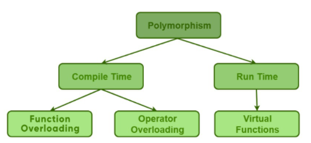

# C++ Fundementals
Some of basic concepts of Cpp Programming is summurized in this documents.

1. *Class*
2. *Objects*
3. *Encapsulation*
4. *Abstraction*
5. *Polymorphism*

## Class
The building block of C++ that leads to Object-Oriented programming is a Class. It is a user-defined data type, which holds its own data members and member functions, which can be accessed and used by creating an instance of that class. A class is like a blueprint for an object.

+ A Class is a user-defined data-type which has data members and member functions.
+ Data members are the data variables and member functions are the functions used to manipulate these variables and together these data members and member functions define the properties and behaviour of the objects in a Class.

``` js

class person
{
    char name[20];
    int id;
public:
    void getdetails(){}
};
```

## Object
An Object is an identifiable entity with some characteristics and behaviour. An Object is an instance of a Class. When a class is defined, no memory is allocated but when it is instantiated memory is allocated.

Object take up space in memory and have an associated address like a record in pascal or structure or union in C.
When a program is executed the objects interact by sending messages to one another.
Each object contains data and code to manipulate the data. Objects can interact without having to know details of each other’s data or code, it is sufficient to know the type of message accepted and type of response returned by the objects.

``` js

class person
int main()
{
   person p1; // p1 is a object 
}
```

## Encapsulation
In normal terms, Encapsulation is defined as wrapping up of data and information under a single unit. In Object-Oriented Programming, Encapsulation is defined as binding together the data and the functions that manipulate them.
Encapsulation also lead to data abstraction or hiding. As using encapsulation also hides the data.
In C++ encapsulation can be implemented using Class and **access modifiers**. Look at the below program:

``` js
#include<iostream>
using namespace std;

class Encapsulation
{
	private:
		// data hidden from outside world
		int x;
		
	public:
		// function to set value of
		// variable x
		void set(int a)
		{
			x = a;
		}
		
		// function to return value of
		// variable x
		int get()
		{
			return x;
		}
};

// main function
int main()
{
	Encapsulation obj;
	
	obj.set(5);
	
	cout<<obj.get();
	return 0;
}

```

Output:
```
60
```

In the above program the variable x is made private. This variable can be accessed and manipulated only using the functions get() and set() which are present inside the class. Thus we can say that here, the variable x and the functions get() and set() are binded together which is nothing but encapsulation.

## Abstraction
Data abstraction is one of the most essential and important feature of object oriented programming in C++. Abstraction means displaying only essential information and hiding the details. Data abstraction refers to providing only essential information about the data to the outside world, hiding the background details or implementation.

#### Abstraction using Classes:
We can implement Abstraction in C++ using classes. Class helps us to group data members and member functions using available access specifiers. A Class can decide which data member will be visible to outside world and which is not.

#### Abstraction in Header files:
 One more type of abstraction in C++ can be header files. For example, consider the pow() method present in math.h header file. Whenever we need to calculate power of a number, we simply call the function pow() present in the math.h header file and pass the numbers as arguments without knowing the underlying algorithm according to which the function is actually calculating power of numbers.

#### Abstraction using access specifiers
Access specifiers are the main pillar of implementing abstraction in C++. We can use access specifiers to enforce restrictions on class members.  
+ Members declared as public in a class, can be accessed from anywhere in the program.
+ Members declared as private in a class, can be accessed only from within the class. They are not allowed to be accessed from any part of code outside the class.

``` js
#include <iostream>
using namespace std;

class Adder {
   public:
      // constructor
      Adder(int i = 0) {
         total = i;
      }
      
      // interface to outside world
      void addNum(int number) {
         total += number;
      }
      
      // interface to outside world
      int getTotal() {
         return total;
      };
      
   private:
      // hidden data from outside world
      int total;
};

int main() {
   Adder a;
   
   a.addNum(10);
   a.addNum(20);
   a.addNum(30);

   cout << "Total " << a.getTotal() <<endl;
   return 0;
}
```
Output:
```
60
```

Above class adds numbers together, and returns the sum. The public members - addNum and getTotal are the interfaces to the outside world and a user needs to know them to use the class. The private member total is something that the user doesn't need to know about, but is needed for the class to operate properly.

## Polymorphism
The word polymorphism means having many forms. In simple words, we can define polymorphism as the ability of a message to be displayed in more than one form. A real-life example of polymorphism, a person at the same time can have different characteristics. Like a man at the same time is a father, a husband, an employee. So the same person posses different behavior in different situations. This is called polymorphism. Polymorphism is considered as one of the important features of Object Oriented Programming.

#### In C++ polymorphism is mainly divided into two types:
+ Compile time Polymorphism
+ Runtime Polymorphism



#### Compile time polymorphism:
This type of polymorphism is achieved by function overloading or operator overloading.

+ **Function Overloading:**
  When there are multiple functions with same name but different parameters then these functions are said to be overloaded. Functions can be overloaded by change in number of arguments or/and change in type of arguments.
  
``` js
// C++ program for function overloading
#include <bits/stdc++.h>

using namespace std;
class Geeks
{
	public:
	
	// function with 1 int parameter
	void func(int x)
	{
		cout << "value of x is " << x << endl;
	}
	
	// function with same name but 1 double parameter
	void func(double x)
	{
		cout << "value of x is " << x << endl;
	}
	
	// function with same name and 2 int parameters
	void func(int x, int y)
	{
		cout << "value of x and y is " << x << ", " << y << endl;
	}
};

int main() {
	
	Geeks obj1;
	
	// Which function is called will depend on the parameters passed
	// The first 'func' is called
	obj1.func(7);
	
	// The second 'func' is called
	obj1.func(9.132);
	
	// The third 'func' is called
	obj1.func(85,64);
	return 0;
}

```

Output:
```
value of x is 7
value of x is 9.132
value of x and y is 85, 64
```

+ **Operator Overloading:**
  C++ also provide option to overload operators. For example, we can make the operator (‘+’) for string class to concatenate two strings. We know that this is the addition operator whose task is to add two operands. So a single operator ‘+’ when placed between integer operands , adds them and when placed between string operands, concatenates them.

``` js
// CPP program to illustrate
// Operator Overloading
#include<iostream>
using namespace std;

class Complex {
private:
	int real, imag;
public:
	Complex(int r = 0, int i =0) {real = r; imag = i;}
	
	// This is automatically called when '+' is used with
	// between two Complex objects
	Complex operator + (Complex const &obj) {
		Complex res;
		res.real = real + obj.real;
		res.imag = imag + obj.imag;
		return res;
	}
	void print() { cout << real << " + i" << imag << endl; }
};

int main()
{
	Complex c1(10, 5), c2(2, 4);
	Complex c3 = c1 + c2; // An example call to "operator+"
	c3.print();
}

```
Output:
```
12 + i9
```

#### Runtime polymorphism:

This type of polymorphism is achieved by Function Overriding.
+ **Function overriding**
  Function overriding on the other hand occurs when a derived class has a definition for one of the member functions of the base class. That base function is said to be overridden.

``` js
// C++ program for function overriding

#include <bits/stdc++.h>
using namespace std;

class base
{
public:
	virtual void print ()
	{ cout<< "print base class" <<endl; }

	void show ()
	{ cout<< "show base class" <<endl; }
};

class derived:public base
{
public:
	void print () //print () is already virtual function in derived class, we could also declared as virtual void print () explicitly
	{ cout<< "print derived class" <<endl; }

	void show ()
	{ cout<< "show derived class" <<endl; }
};

//main function
int main()
{
	base *bptr;
	derived d;
	bptr = &d;
	
	//virtual function, binded at runtime (Runtime polymorphism)
	bptr->print();
	
	// Non-virtual function, binded at compile time
	bptr->show();

	return 0;
}

```
